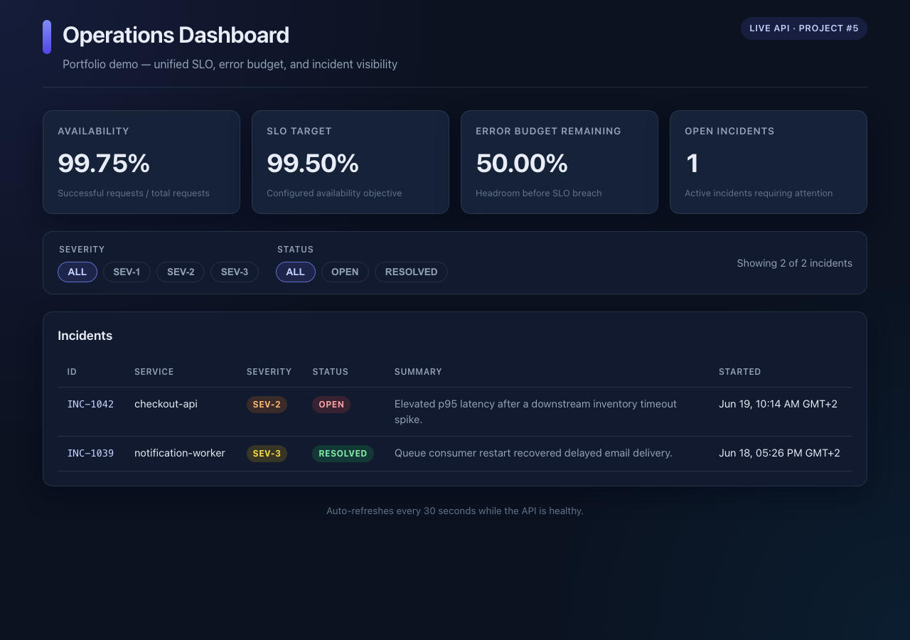

# Operations Dashboard

A production-style React operations app for fleet health, persisted URL monitors, and incident context. It consumes the live [Service Health & Incident Monitor](https://github.com/mithulram/service-health-incident-monitor) backend (portfolio project #4).

Public summary and incident endpoints remain readable without credentials. Monitor management routes are protected on the backend with `ADMIN_API_KEY`; this UI stores that key locally in the browser and sends `Authorization: Bearer <key>` only for protected monitor requests.

## Live demo

| Service | URL |
|---|---|
| Backend API | https://service-health-incident-monitor.onrender.com |
| Frontend dashboard | https://operations-dashboard-b8v.pages.dev |

Verify the deployed public dashboard + API (requires Node 22+):

```bash
nvm use
FRONTEND_URL=https://operations-dashboard-b8v.pages.dev \
API_URL=https://service-health-incident-monitor.onrender.com \
npm run smoke:deployed
```

The smoke test checks public HTML, health/summary/incidents endpoints, and CORS. It does not exercise protected monitor management because no admin key is available in CI or smoke scripts.



## Problem statement

Platform and SRE teams routinely juggle separate tools for uptime checks, fleet health, and incident context. This project shows a focused operations product UI that combines fleet monitor status, check history, synthetic SLO signals, and incident metadata in one responsive, accessible app with filtering, loading states, and automatic refresh on the dashboard.

## Prerequisites

- **Node.js 22+** (see `.nvmrc`). With [nvm](https://github.com/nvm-sh/nvm): `nvm use`
- npm (bundled with Node)

## Quick start

Start the backend first (project #4):

```bash
git clone https://github.com/mithulram/service-health-incident-monitor.git
cd service-health-incident-monitor
python3 -m venv .venv
source .venv/bin/activate
python -m pip install -e '.[test]'
DEMO_MODE=true uvicorn service_monitor.app:app --host 127.0.0.1 --port 8090
```

For local monitor management against a protected backend, run the backend with a known `ADMIN_API_KEY` instead of `DEMO_MODE=true`.

Then run the dashboard:

```bash
git clone https://github.com/mithulram/operations-dashboard.git
cd operations-dashboard
nvm use
npm ci
npm run dev
```

Open [http://127.0.0.1:5173](http://127.0.0.1:5173). Vite proxies `/api` and `/healthz` to `http://127.0.0.1:8090` during development.

### Admin API key (local only)

1. Open **Settings** in the dashboard.
2. Paste the backend `ADMIN_API_KEY` value.
3. Save. The key is stored in this browser's `localStorage` only.
4. Use **Monitors** to create, edit, pause, delete, and run checks.

Never commit the real admin key. Do not put `ADMIN_API_KEY` in frontend build environment variables or Cloudflare Pages settings.

### Environment

| Variable | Purpose |
|---|---|
| `VITE_API_BASE_URL` | Optional API origin. Leave empty to use relative paths via the Vite dev proxy or same-origin deployment. Trailing slashes are normalized automatically. |

Example for a deployed API:

```bash
VITE_API_BASE_URL=https://monitor.example.com npm run build
```

## Deploy for free

Recommended setup:

| Layer | Host | Notes |
|---|---|---|
| Backend | [Render](https://render.com) Free Web Service | Deploy [service-health-incident-monitor](https://github.com/mithulram/service-health-incident-monitor) first |
| Frontend | [Cloudflare Pages](https://pages.cloudflare.com) or Render Static Site | Node 22, build `dist` output |

**Frontend build settings**

| Setting | Value |
|---|---|
| Build command | `npm ci && npm run build` |
| Output directory | `dist` |
| Node version | `22` |
| `VITE_API_BASE_URL` | `https://<render-backend>.onrender.com` |

Do **not** set `ADMIN_API_KEY` in the frontend build. Users enter it in Settings after deployment.

**Deployment order**

1. Deploy the backend and note its `https://*.onrender.com` URL.
2. Deploy this frontend with `VITE_API_BASE_URL` set to that backend URL.
3. Update the backend `WEB_CORS_ORIGINS` environment variable with the final frontend origin (for example `https://operations-dashboard-b8v.pages.dev`).
4. Redeploy the backend so CORS allows the dashboard origin.
5. Run the deployed smoke test (Node 22+ required):

```bash
nvm use
FRONTEND_URL=https://your-dashboard.pages.dev \
API_URL=https://your-monitor.onrender.com \
npm run smoke:deployed
```

## Scripts

```bash
nvm use               # use Node 22+ from .nvmrc
npm ci                # install dependencies from package-lock.json
npm run dev           # start Vite dev server with API proxy
npm test              # run Vitest component tests
npm run build         # type-check and produce production build
npm run smoke:deployed  # verify live frontend + API after deploy
```

## Architecture

- **React + TypeScript + Vite + react-router-dom** for a typed SPA with Dashboard, Monitors, Incidents, and Settings views.
- **`src/api/client.ts`** — typed `fetch` wrapper with public and protected monitor endpoints.
- **`src/auth/adminKey.ts`** — localStorage helpers for the user-entered admin key.
- **`src/context/AdminKeyContext.tsx`** — shared auth state for monitor management.
- **Components** — fleet summary cards, monitor list with check history, settings panel, filter bar, incidents table, loading skeleton, and error banner with retry.
- **Accessibility** — semantic landmarks, `aria-live` regions, keyboard-friendly controls, and table captions.
- **CI** — GitHub Actions runs `npm ci`, `npm test`, and `npm run build` on every push.

## API contract

| Endpoint | Auth | Used for |
|---|---|---|
| `GET /healthz` | Public | Liveness check |
| `GET /api/v1/summary` | Public | Fleet monitor counts, synthetic SLO metrics, open incident count |
| `GET /api/v1/incidents` | Public | Incident list with severity, status, and timestamps |
| `GET /api/v1/monitors` | Bearer admin key | Monitor list |
| `POST /api/v1/monitors` | Bearer admin key | Create monitor |
| `PATCH /api/v1/monitors/{id}` | Bearer admin key | Update or pause monitor |
| `DELETE /api/v1/monitors/{id}` | Bearer admin key | Delete monitor |
| `POST /api/v1/checks/run/{id}` | Bearer admin key | Run check now |
| `GET /api/v1/monitors/{id}/checks` | Bearer admin key | Recent check history |

## Screenshots

| View | File |
|---|---|
| Desktop | `docs/screenshots/dashboard-desktop.png` |
| Mobile | `docs/screenshots/dashboard-mobile.png` |

Capture after starting the Service Health backend and `npm run dev`.

## Resume-ready description

> Built a TypeScript/React operations product UI with react-router navigation, local admin-key auth for protected monitor APIs, fleet health cards, monitor CRUD with check history, incident filtering, accessible loading/retry states, Vitest coverage, and GitHub Actions CI against a live Render backend.

## License

MIT. See [LICENSE](LICENSE).
