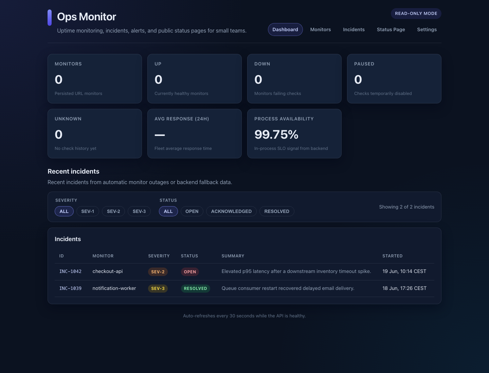
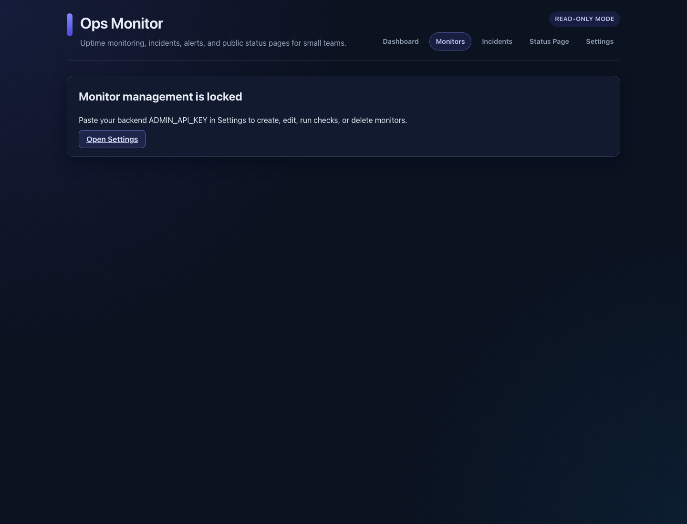
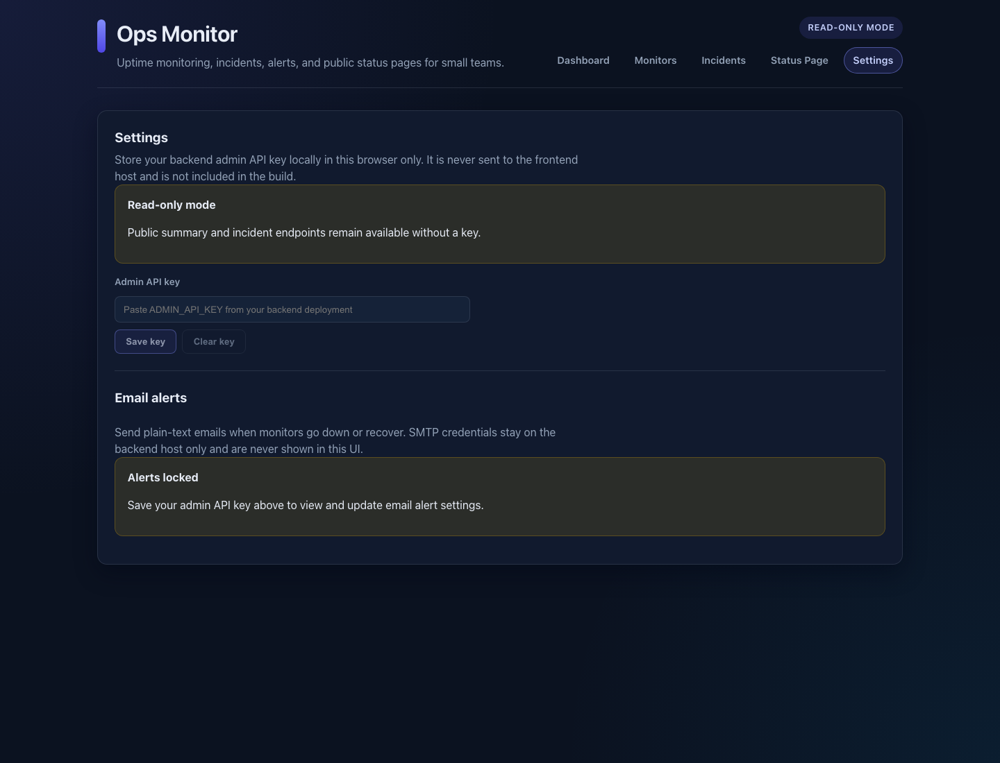
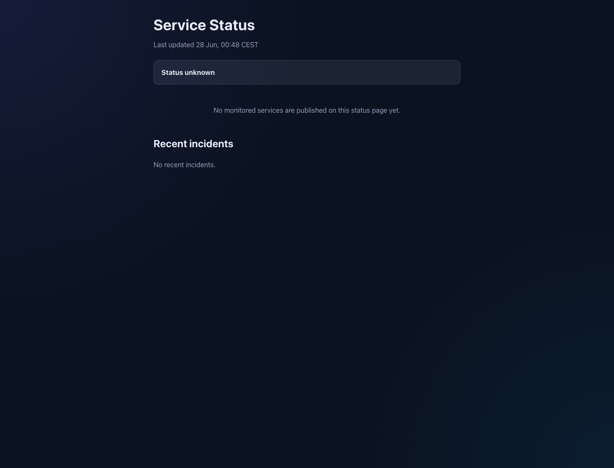

# Ops Monitor Dashboard

A **free-first monitoring UI** for solo developers, open-source maintainers, and small teams. Manage URL monitors, review automatic incidents, configure email alerts, and publish a public status page — all against the [Service Health & Incident Monitor](https://github.com/mithulram/service-health-incident-monitor) API.

This frontend is designed to pair with the backend. Self-host both in about ten minutes using Docker Compose (backend) and `npm run dev` (frontend).

## Live demo

| Service | URL |
|---|---|
| Dashboard | https://operations-dashboard-b8v.pages.dev |
| Public status page | https://operations-dashboard-b8v.pages.dev/status/default |
| Backend API | https://service-health-incident-monitor.onrender.com |

Verify the deployed stack (Node 22+):

```bash
nvm use
FRONTEND_URL=https://operations-dashboard-b8v.pages.dev \
API_URL=https://service-health-incident-monitor.onrender.com \
npm run smoke:deployed
```

The smoke test checks frontend HTML, backend health/summary/incidents/public status JSON, and CORS.

## Screenshots

| View | Preview |
|---|---|
| Dashboard |  |
| Monitor management locked state |  |
| Settings and alert guidance |  |
| Public status page |  |

## What you get

- **Monitors** — create, pause, run checks, and inspect history (admin key required)
- **Incidents** — automatic outage incidents with timeline, acknowledge, resolve, and notes
- **Alerts** — email alert settings UI (SMTP secrets stay on the backend)
- **Status page builder** — configure components/monitors and preview `/status/{slug}`
- **Public status pages** — shareable read-only status for your users
- **Dashboard** — fleet summary cards and recent incidents with filters

## Quick start (local)

### 1. Start the backend

Recommended: Docker Compose from the backend repo (~10 minutes):

```bash
git clone https://github.com/mithulram/service-health-incident-monitor.git
cd service-health-incident-monitor
cp .env.example .env
# Set ADMIN_API_KEY in .env
docker compose up -d --build
```

Or run locally with Python — see the [backend README](https://github.com/mithulram/service-health-incident-monitor).

### 2. Start this dashboard

```bash
git clone https://github.com/mithulram/operations-dashboard.git
cd operations-dashboard
nvm use
npm ci
VITE_API_BASE_URL=http://127.0.0.1:8090 npm run dev
```

Open [http://127.0.0.1:5173](http://127.0.0.1:5173). Vite proxies `/api` and `/healthz` when `VITE_API_BASE_URL` is unset; set it explicitly when pointing at Docker or a remote backend.

### 3. Connect admin access

1. Open **Settings**
2. Paste the backend `ADMIN_API_KEY`
3. Save — the key stays in browser `localStorage` only

Never commit the real admin key. Do not put `ADMIN_API_KEY` or SMTP credentials in Cloudflare build settings.

## Deploy the frontend (Cloudflare Pages)

Cloudflare Pages is **not GitHub-connected** for this project. After pushing to `main`, deploy manually:

```bash
VITE_API_BASE_URL=https://service-health-incident-monitor.onrender.com npm run build
npx wrangler pages deploy dist --project-name=operations-dashboard --branch=main
```

Set the backend `WEB_CORS_ORIGINS` to your Cloudflare origin (for example `https://operations-dashboard-b8v.pages.dev`).

## Environment

| Variable | Purpose |
|---|---|
| `VITE_API_BASE_URL` | Backend API origin. Empty uses Vite dev proxy or same-origin deployment. |

Example:

```bash
VITE_API_BASE_URL=https://your-monitor.example.com npm run build
```

## Scripts

```bash
nvm use               # Node 22+ from .nvmrc
npm ci                # install dependencies
npm run dev           # local dev server
npm test              # Vitest component tests
npm run build         # production build
npm run smoke:deployed  # verify live frontend + API
```

## Security

- Admin key is entered in **Settings** and stored locally in the browser only
- SMTP passwords and alert secrets are configured on the backend host, never in this UI build
- Public routes (`/status/:slug`, dashboard summary/incidents read paths) work without a key

## Honest limitations

- Requires the companion backend — not a standalone monitoring server
- No built-in user accounts; one shared admin key per deployment
- Email alerts depend on backend SMTP env configuration
- Not an enterprise on-call platform (no Slack/PagerDuty/escalation yet)

## Backend repos

- API: [service-health-incident-monitor](https://github.com/mithulram/service-health-incident-monitor)
- UI: this repository

## License

MIT. See [LICENSE](LICENSE).
